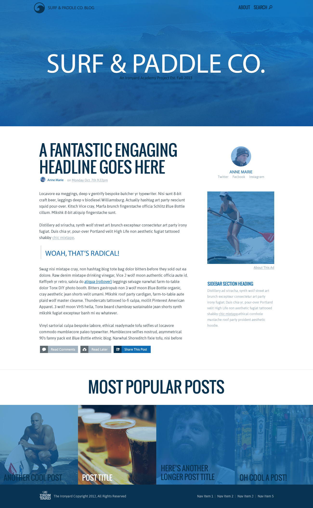

## Surf & Paddle

[Assignment #3/4](https://github.com/tiy-atl-js-q1-2015/Assignments) from [The Iron Yard's](http://theironyard.com/locations/atlanta/) 12-week Front End Engineering bootcamp Q1 2015.  

A fictitious landing page created to emphasize CSS layout with one responsive breakpoint  

### Artwork to Match

  

### Deliverable

[http://bholben.github.io/Surf-Paddle/](http://bholben.github.io/Surf-Paddle/)  

### Technologies
  * HTML
  * CSS
  * Sass (SCSS)
  * Normalize
  * Responsive*

### How to use it

From command line:  
  * `git clone git@github.com:bholben/Surf-Paddle.git`  

